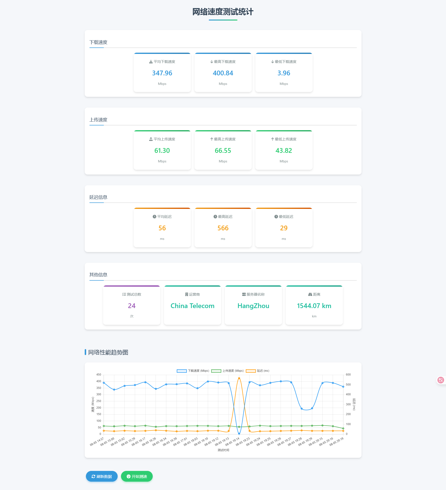

# Network Speed Test Application

> Part of this project's code was written with AI assistance.

A simple yet functional network speed test application that measures download speed, upload speed, and network latency, and displays the test results in chart form.

## Features

- Measures download speed, upload speed, and network latency
- Real-time charts showing test result trends
- Grouped display of statistical information (average/maximum/minimum speed and latency)
- Displays ISP, server name, and distance information
- Data persistence (SQLite database)
- Clean and aesthetically pleasing web interface

## Tech Stack

- **Backend**: Go language
- **Frontend**: HTML, CSS, JavaScript
- **Data Visualization**: Chart.js
- **Database**: SQLite
- **Network Testing Library**: speedtest-go

## Project Structure

```
├── go.mod              # Go module definition
├── go.sum              # Dependency list
├── main.go             # Main program entry
├── webserver.go        # Web server implementation
├── results.db          # SQLite database file
├── templates/          # HTML templates
│   └── index.html      # Main page
├── README.md           # Project description (Chinese)
└── README_EN.md        # Project description (English)
```

## Installation and Running

### Prerequisites

- Go language environment installed (1.16+)
- Stable network connection

### Running Steps

1. Clone or download the project code

```bash
git clone https://github.com/soease/speed.git
cd speed
```

2. Install dependencies

```bash
go mod tidy
```

3. Start the application

```bash
go run . -web
```

4. Open in browser

```
http://localhost:8081
```

## Usage Instructions

### Web Interface Usage
1. Click the "Start Speed Test" button to perform a network speed test
2. After the test is complete, the results will be automatically updated in the charts and statistics area
3. Click the "Refresh Data" button to manually refresh and display the latest data
4. The statistics area displays download speed, upload speed, latency information, and other information in groups
5. The other information area displays ISP, server name, and distance

### Command Line Usage
In addition to the web interface, the application also supports command line operations:

1. **No parameters**: Use the default server for speed test
```bash
./speedtest.exe
```

2. **List all available servers**: Display the first 50 available servers
```bash
./speedtest.exe -servers
```

3. **Specify server ID for speed test**: Use a specific server by ID
```bash
./speedtest.exe -serverid <server_id>
```

4. **List all test records**: Display test records saved in the database
```bash
./speedtest.exe -list
```

5. **Start automatic speed test**: Set interval (minutes) for periodic speed tests
```bash
./speedtest.exe -interval <minutes>
```

## Command Line Parameters

| Parameter | Description | Example |
|-----------|-------------|---------|
| `-web` | Start web server to display statistics charts | `./speedtest.exe -web` |
| `-port` | Specify web server port (default 8081) | `./speedtest.exe -web -port 8080` |
| `-list` | List all test records | `./speedtest.exe -list` |
| `-servers` | List all available servers | `./speedtest.exe -servers` |
| `-serverid` | Specify server ID for speed test | `./speedtest.exe -serverid 59386` |
| `-interval` | Automatic speed test interval (minutes), 0 means no automatic test | `./speedtest.exe -interval 30` |
| `-limit` | Maximum number of test records displayed in trend chart (default 100) | `./speedtest.exe -web -limit 200` |

## Screenshot Display

> Please run the application, use a screenshot tool to capture the interface, and save it as screenshot.png in the project root directory



## License

This project is modified based on the MIT License. The main terms are as follows:

1. You may freely use, copy, modify, merge, publish, distribute, sublicense, and/or sell copies of this software
2. The original copyright notice and license information must be retained in all copies or substantial portions of the software
3. **Before referencing or using this Software, you must send an email notification to [scwy@qq.com](mailto:scwy@qq.com) stating your intended use**
4. The software is provided "as is" without any warranty

For details, please see the LICENSE file.

## Contribution

Issues and pull requests are welcome to provide improvements and new features to the project.

## Contact Information

If you have any questions or suggestions, please contact [scwy@qq.com](mailto:scwy@qq.com)

Website: [https://i.scwy.net](https://i.scwy.net)